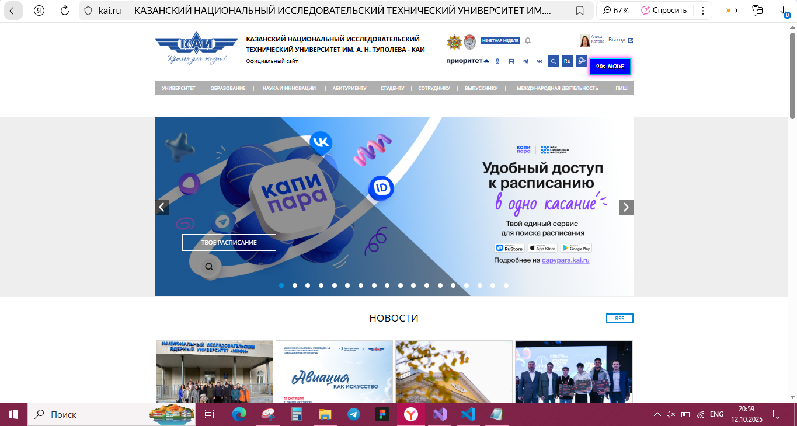
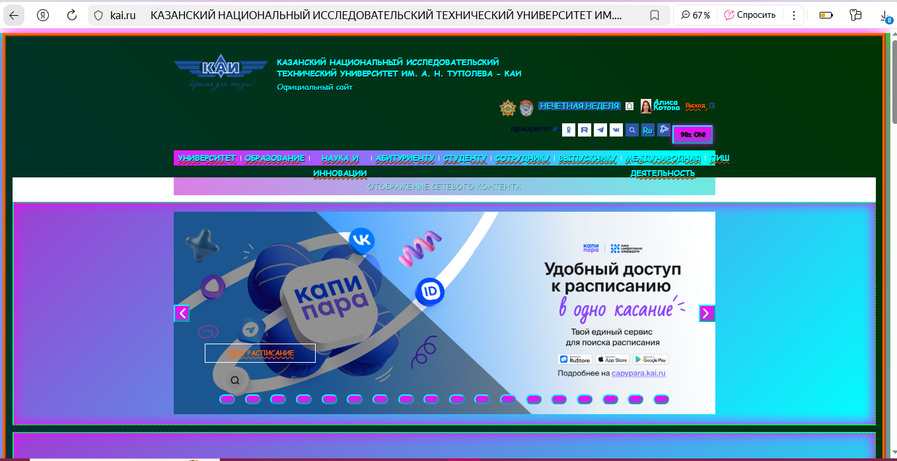
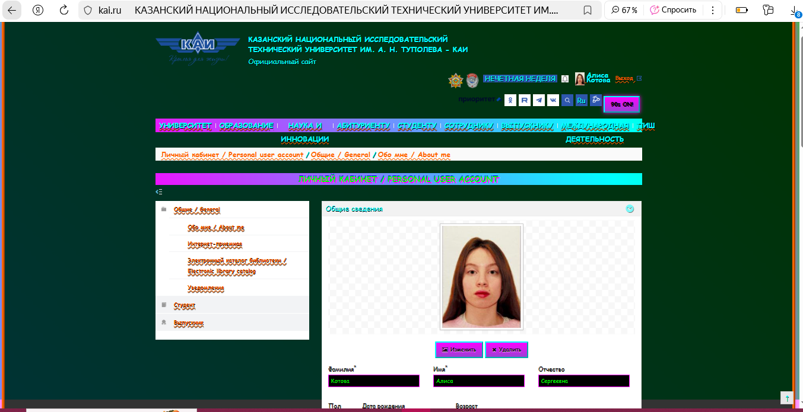
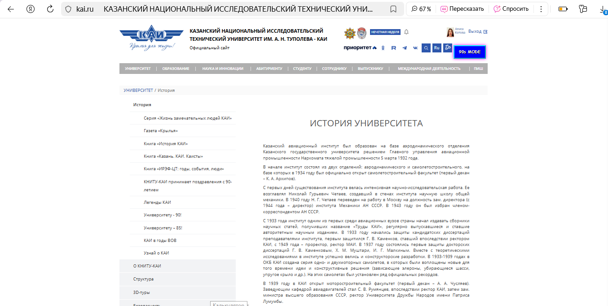
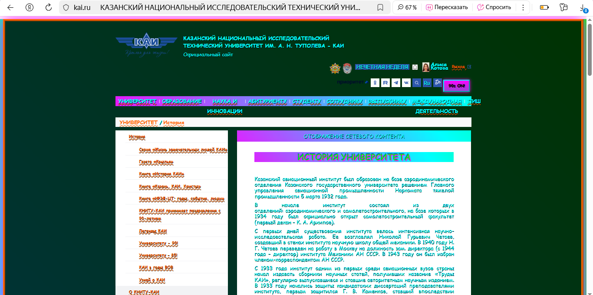

# Расширение для браузера Yandex

## Описание
Расширение преобразует внешний вид сайта КАИ (kai.ru) под стиль веб-сайтов 90-х (кислотные оттенки, соответствуюший шрифт). 
Плагин соответствует варианту "90's Website: Яркий, кислотный фон, анимированные гифки в качестве курсора, мигающий текст (<blink> через CSS animation)." 

## Функциональность
- Кнопка переключения в правом верхнем углу страницы. Она отображает текущий статус стиля: когда он выключен, то на кнопке написано "90s MODE" - предложение переключить стиль. При включенном стиле 90-х на кнопке написано "90s ON!".
- Статус стиля сохраняется при перезагрузке страницы
- Работа на всех страницах - работает на главной странице и внутренних страницах kai.ru, а таккже на странице abiturientu.kai.ru.
- Изменены фон, цвета, шрифт текста, границы, отступы и тд.

## Инструкция
1. Скачайте все файлы плагина в одну папку
2. Откройте в Yandex `browser://extensions/` или перейдите в `Настройки` → `Расширения`
4. Включите "Режим разработчика" 
5. Нажмите "Загрузить распакованное расширение"
6. Выберите папку с файлами плагина
7. Нажмите "Выбор папки"
8. Включите расширение 
9. Зайдите на сайт kai.ru
10. Нажмите на появившуюся кнопку "90s MODE"

## Примеры

## Пример 1
 
 

## Пример 2

## Пример 3

## Пример 4

